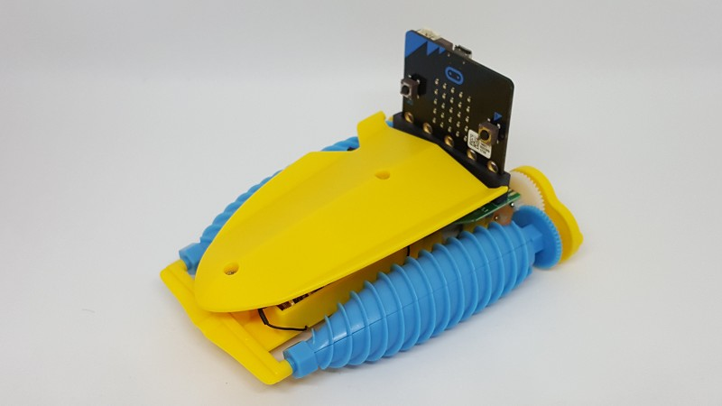
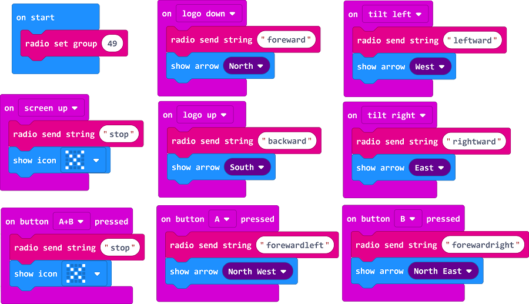
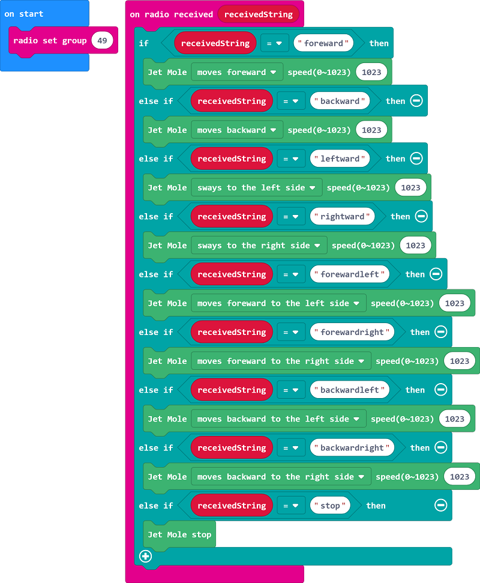

# Jet_Mole

這是專為Twin Drill Jet Mole提供的控制積木\
This is the extension for Twin Drill Jet Mole.

## Author
Liou Zheng-Ji\
劉正吉\
[My page, https://sites.google.com/jes.mlc.edu.tw/ljj/](https://sites.google.com/jes.mlc.edu.tw/ljj/)

## Description

If you want the detail description, please visit my website:\
[https://sites.google.com/jes.mlc.edu.tw/ljj/microbit開發板/microbit積木/twin-drill-jet-mole積木](https://sites.google.com/jes.mlc.edu.tw/ljj/microbit開發板/microbit積木/twin-drill-jet-mole積木)\

## Video: Control the Jet Mole by joystick 
[](https://www.youtube.com/watch?v=0uO_tArxPAQ)

## Video: Control the Jet Mole by single micro:bit 
[](https://www.youtube.com/watch?v=V6TPx1I6-A8)

## Example: Remote control mode
The code of controller\

 \
 \
 \
The code of Jet Mole\


## License

* MIT

## Supported targets

* for PXT/microbit
(The metadata above is needed for package search.)

```package
Jet_Mole=github:lioujj/pxt-Jet_Mole
```